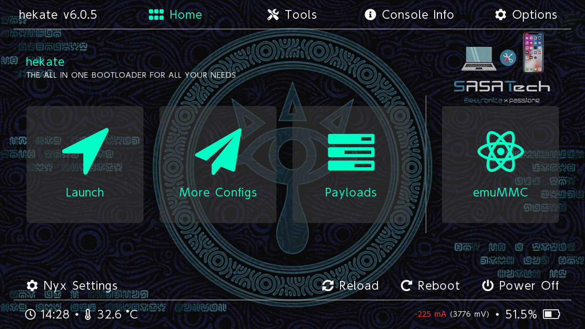
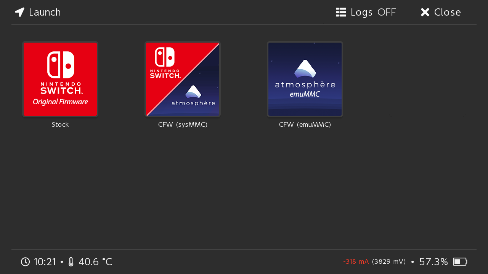

# HATS Precompilato NS Picofly

## Pacchetto HATS precompilato per Nintendo Switch - Picofly -

## Il pacchetto contiene:
###### Homebrew:
- [x] Hekate bootloader
- [x] Atmosphère CFW
- [x] Tinfoil
- [x] DBI
- [x] Awoo-Installer
- [x] Homebrew App Store
- [x] Breeze
- [x] EdiZon
- [x] ftpd
- [x] NXThemesInstaller
- [x] AIO-Switch-Updater
- [x] Daybreak
- [x] Haze
- [x] JKSV
- [x] Switch-90DNS-Tester
- [x] Linkalho
- [x] nxdumptool
- [x] nxshell
- [x] sys-clk-manager

 ###### Payloads:
 - [x] Lockpick_RCM
 - [x] picofly_toolbox_0.2
 - [x] prodinfo_gen

#### *I server Nintendo sono stati bloccati preventivamente e il seriale della console è stato sbiancato per ridurre al minimo il rischio di ban.*
